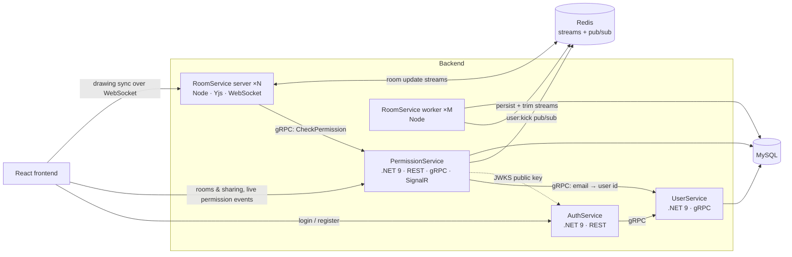

# TeamSketch Backend

[](https://github.com/hajduty/teamsketch_backend/actions/workflows/ci.yml)

Backend for **TeamSketch**, a real-time collaborative whiteboard. Users sign up, create rooms, invite others as editors or viewers, and draw together live.

[Blog post](https://www.hajder.app/projects/teamsketch) · [Frontend repo](https://github.com/hajduty/teamsketch_frontend)


## Architecture



| Service | Stack | Responsibility |
|---|---|---|
| **AuthService** | ASP.NET Core | Issues RS256 JWTs and publishes the public key at `/.well-known/jwks.json`. |
| **UserService** | ASP.NET Core gRPC, EF Core | Accounts and password hashing. Internal only, reachable over gRPC. |
| **PermissionService** | ASP.NET Core, EF Core, SignalR | Room ownership and roles (owner / editor / viewer). REST for the frontend, gRPC for RoomService, SignalR to push permission changes to clients. |
| **RoomService** | Node.js, [Yjs](https://yjs.dev) | Real-time document sync over WebSocket, using [y/hub (y-redis)](https://github.com/yjs/y-redis). |

The contracts between services live in [`Shared/Contracts/Protos`](Shared/Contracts/Protos). The .NET services and the Node RoomService load the same `.proto` files.

### Real-time sync

RoomService runs [y/hub](https://github.com/yjs/y-redis), Kevin Jahns' Redis-backed server for Yjs. Its design is why the sync can scale out:

- Each room is a Redis stream, so the WebSocket servers keep no document state and any instance can serve any room.
- Separate worker processes persist the streams to storage and trim them, so servers and workers scale independently.

What TeamSketch adds on top:

- **Auth.** The frontend connects to `wss://…/{room}/{jwt}`. On upgrade, RoomService calls `CheckPermission` on PermissionService over gRPC. Editors and owners get a writable socket, viewers a read-only one.
- **Kicking.** When access is removed, PermissionService publishes `user:kick` on Redis. Every RoomService instance closes that user's sockets.
- **MySQL storage** for the documents, so they live in the same database as everything else.
- **Kubernetes setup:** separate server and worker Deployments, and an autoscaler on the server.

## Running locally

Requires Docker.

```bash
git clone https://github.com/hajduty/teamsketch_backend.git
cd teamsketch_backend
docker compose up --build
```

| | URL |
|---|---|
| AuthService | http://localhost:7154 |
| PermissionService (REST / SignalR) | http://localhost:7100 |
| RoomService (WebSocket) | ws://localhost:3002 |

Then run the [frontend](https://github.com/hajduty/teamsketch_frontend) on `http://localhost:5173`.

## Testing

| Suite | What it covers | Runs on |
|---|---|---|
| `*/…Tests` | Unit tests for each .NET service (xUnit, Moq). | `dotnet test` |
| `E2E.Tests` (in-process) | Auth, User and Permission services hosted together with `WebApplicationFactory` and in-memory databases. | `dotnet test` |
| `E2E.Tests` (Docker) | The full system in containers through [Testcontainers](https://dotnet.testcontainers.org/): MySQL, Redis and every service image. Includes registering, creating a room, sharing it, connecting over WebSocket, and checking that a revoked user gets disconnected. | `docker compose build && dotnet test` |
| `RoomService/tests` | The storage contract (memory and MySQL) and the Redis stream API. | `npm test` with `REDIS` and `MYSQL` set |

GitHub Actions runs all of these on every pull request.

## Deployment

**Docker Compose / self-hosted:** the live instance is self-hosted with Docker Compose through [Coolify](https://coolify.io). The services are configured with environment variables.

**Azure Kubernetes Service (reference setup):** the [`infra`](infra) folder can rebuild the full stack on Azure:

- [`infra/modules`](infra/modules) (Bicep): AKS, Azure Container Registry, Azure Database for MySQL Flexible Server, and the AcrPull role assignment.
- [`infra/charts`](infra/charts) (Helm): a Deployment and Service per service, separate RoomService server and worker Deployments, an HPA for the RoomService server, health probes, and NGINX ingress with cert-manager TLS.
- [`azure-pipelines.yml`](azure-pipelines.yml): builds and pushes the images, runs EF Core migrations, then runs `helm upgrade --install`.

AKS isn't the hosting target: a one-node cluster costs more than the whole VPS. The setup shows how the system deploys to Kubernetes and scales there.

## Design notes and tradeoffs

- **gRPC between services, REST and WebSocket at the edge.** The internal calls are typed through shared protos. The browser only talks REST, SignalR and the Yjs WebSocket protocol.
- **Asymmetric JWTs.** Only AuthService holds the private key. Other services check tokens with the public key from JWKS, so no shared secret is spread across services.
- **Redis stores real-time state for a short time.** In y/hub, updates live in Redis until a worker persists them, which is within about 10 seconds by default. Losing Redis loses only that window. A production setup would run Redis with persistence or as a managed service.
- **One database engine.** The service tables and the Yjs documents are both in MySQL, so there is only one stateful system to run and back up. RoomService still supports S3 or Postgres for documents through environment variables.
- **Splitting Auth from User.** AuthService only issues tokens and UserService owns the user data. For a project this size they could be merged. They're separate to keep credential handling apart from token signing.
